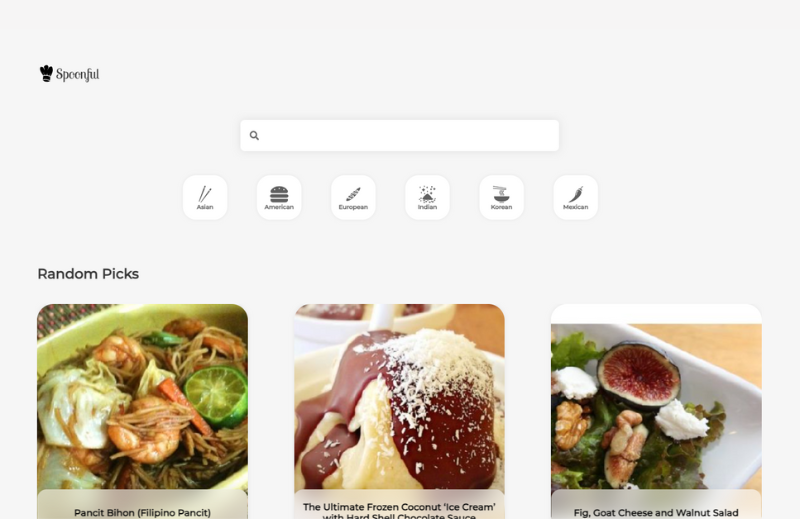
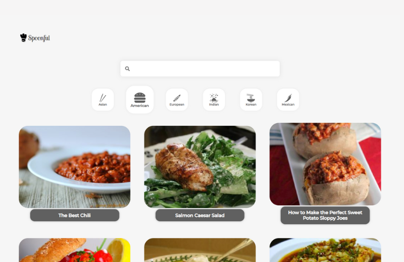
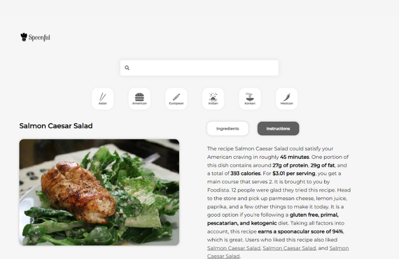

# Spoonful 🍴👨🏻‍🍳

Spoonful é um projeto em React que permite aos usuários explorar receitas usando a API Spoonacular. Para começar a usar o Spoonful, você precisará obter uma chave de API gratuita do Spoonacular e configurá-la no projeto.

## Configurando a Chave da API Spoonacular 🔑🔒

1. Visite o [site da Spoonacular](https://spoonacular.com/food-api) para obter uma chave de API gratuita.
2. Crie uma conta ou faça login, se necessário.
3. Siga as instruções para obter sua chave de API.
4. Após obter sua chave de API, você precisa configurá-la no projeto Spoonful.
5. No diretório raiz do projeto Spoonful, crie um arquivo `.env` (se já não existir).
6. Dentro do arquivo `.env`, adicione a seguinte linha, substituindo `SUA_CHAVE_API` pela sua chave de API do Spoonacular: `.REACT_APP_SPOONACULAR_API_KEY=SUA_CHAVE_API`
7. Salve o arquivo `.env`.

## Como Executar o Projeto ⚙️

1. Certifique-se de ter o Node.js instalado em seu sistema. Você pode baixá-lo em [nodejs.org](https://nodejs.org/).
2. Clone este repositório para o seu computador ou faça o download do arquivo ZIP e extraia-o.
3. No terminal, navegue até o diretório raiz do projeto.
4. Execute o seguinte comando para instalar as dependências:`.npm install`
5. Após a instalação das dependências, execute o seguinte comando para iniciar o servidor de desenvolvimento:`.npm start`
6. O projeto será aberto em seu navegador padrão. Se não abrir automaticamente, você pode acessá-lo em [http://localhost:3000](http://localhost:3000).

## Como Contribuir 🤝

Se você gostaria de contribuir para o Spoonful, sinta-se à vontade para abrir uma issue ou enviar uma solicitação pull. Toda contribuição é bem-vinda!

## Licença

Este projeto é licenciado sob a [Licença MIT](https://opensource.org/licenses/MIT).

